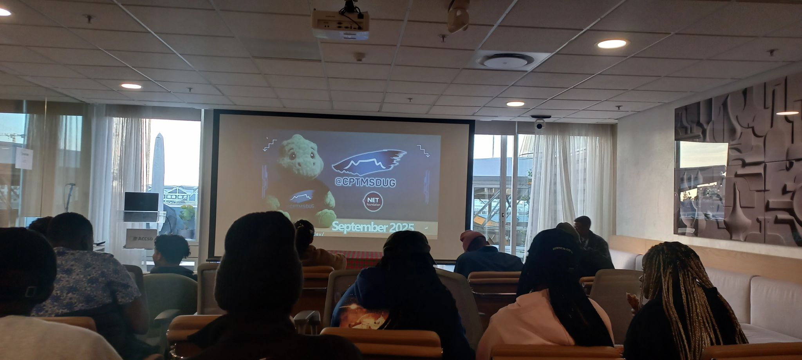
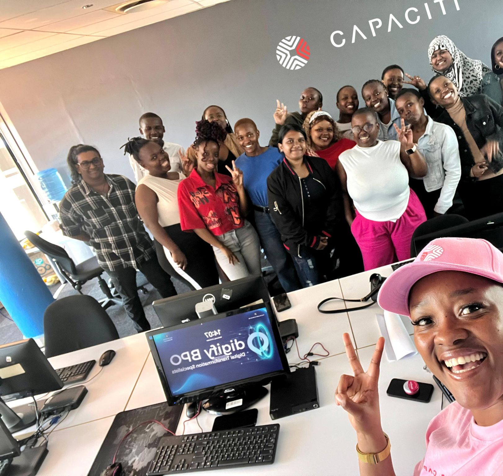
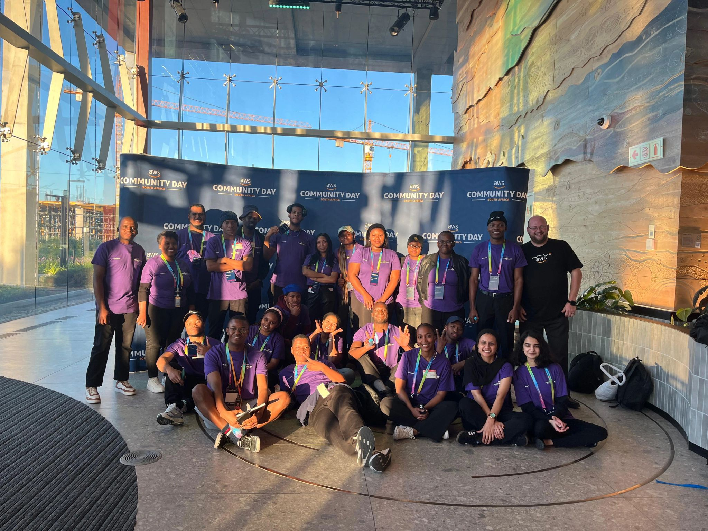

# Work Readiness & Professional Development

A comprehensive showcase of professional skills, training outcomes, and reflections from the Work Readiness program at Cape Peninsula University of Technology.

---

## Business Communication

**Learning professional communication in a real software development environment**

### Real-World Technical Communication

Developed professional communication skills during placement at Plum Systems, working on Issue #459 - a high-priority bug affecting mobile app and web portal synchronization.

#### Key Highlights

- Clear technical documentation with evidence and screenshots
- Effective use of issue tracking systems and team communication tools
- Professional status updates and progress reporting
- Collaborative problem-solving with cross-functional team members
- Escalation protocols and conflict resolution in technical environments

### Learning Reflection: STAR Technique

**Situation**  
During my placement at Plum Systems, I got involved in fixing a serious bug (Issue #459) where information people entered on the mobile app wasn't showing up properly on the web portal. It was marked as high priority because it was affecting actual users, and I had to figure out how to communicate with a whole team of people—testers like Tristan Sampson, Nontando Zondi, and Thaakirah Watson, plus my supervisor Luyolo Skoma and other developers on the team.

**Task**  
I needed to learn how to actually communicate in a real software development environment. That meant figuring out how to document problems clearly, give useful status updates, know when to tag someone for assistance versus when to tag testers to verify bug fixes, understand when to escalate issues, and keep things professional even when stuff wasn't working.

**Action**  
I started by watching how the team communicated and taking notes on what seemed to work. I noticed that good updates were specific—not vague things like 'still working on it.' People attached screenshots and documents as proof. They used '@' mentions strategically—tagging developers when they needed assistance with a bug, or tagging testers when a fix was ready to be verified and tested.

**Result**  
My writing got so much better during that placement. Luyolo actually told me my updates were 'clear and professional—exactly what we need on the team.' I realized that good business communication in tech isn't about writing long formal emails or using fancy words. It's about being clear, backing up what you say with evidence, and not wasting people's time.

.png)
.png)
.png)

---

## Interview Skills

**Transforming interview anxiety into confidence through structured practice and preparation**

### Interview Mastery Through SHL Platform Training

Overcame severe interview anxiety through intensive practice using the SHL online platform, mock interviews with industry professionals, and systematic skill development using the STAR technique.

#### Key Highlights

- SHL video interview platform mastery with 30-45 second prep time
- STAR technique implementation across 12 prepared scenarios
- Company research methodology for 15+ target organizations
- Technical communication skills for non-technical audiences
- Professional video presence and body language improvement
- Callback rate improvement from 10% to 60%

### Learning Reflection: STAR Technique

**Situation**  
I used to absolutely dread interviews. During my work readiness program, my first few mock interviews were honestly terrible. I'd freeze up when asked behavioral questions, ramble through my answers without any structure, and barely make eye contact because I was so nervous.

**Task**  
I had to completely transform how I approached interviews. I needed to learn the STAR technique everyone kept talking about, get comfortable on camera (since most interviews were happening online), fix my body language and eye contact issues, and somehow turn my anxiety into actual confidence.

**Action**  
The real game-changer was the SHL online platform. It simulates real interviews where you get a question on screen and have maybe 30-45 seconds to think before the camera starts recording your answer. I built a collection of 12 stories from my life using the STAR format—covering teamwork, problem-solving, conflicts I'd dealt with, technical challenges, everything. I researched about 15 companies I was interested in and did 8 mock interviews with real professionals.

**Result**  
My confidence went from like a 3 out of 10 to maybe an 8 out of 10. My callback rate jumped from about 10% to 60%, which was huge. Real confidence doesn't come from memorizing perfect answers—it comes from preparing thoroughly, knowing your own story, and being okay with being human.

---

## Mock Interview

**Intensive mock interview experience with Microsoft recruiter providing real-world assessment**

### Professional Mock Interview Assessment

Completed a comprehensive 50-minute mock interview with Sarah Chen, a senior IT recruiter with 12 years at Microsoft and other tech companies, including behavioral and technical assessments with video recording.

#### Key Highlights

- 30-minute behavioral interview using STAR methodology
- 20-minute technical whiteboard assessment for Systems Analyst role
- Professional video recording and detailed feedback session
- Database design problem-solving under pressure
- Self-correction and adaptability demonstration
- Business-focused questioning and engagement

### Learning Reflection: STAR Technique

**Situation**  
I participated in this intense mock interview that was designed to feel exactly like a real job interview in the ICT field. The interviewer was Sarah Chen, who'd worked as a senior IT recruiter at Microsoft and other tech companies for 12 years. It was a 30-minute behavioral interview followed by a 20-minute technical assessment, and they recorded the whole thing on video.

**Task**  
I had to demonstrate that I could handle both behavioral questions using the STAR method and solve technical problems on a whiteboard while explaining my thinking. Plus, I had to manage my very visible nervousness and make a strong enough impression that Sarah would theoretically move me forward to the next round.

**Action**  
I spent three solid days preparing. I reviewed typical systems analyst responsibilities, went back through my coursework on database management and systems design, and practiced 15 common behavioral questions with my study partner. During the technical part, she gave me a scenario about designing a database for a library system. I talked through my approach on the whiteboard step by step. I made a mistake in my initial database design, but I caught it myself and fixed it right there instead of trying to pretend it was correct.

**Result**  
Sarah said my technical communication was strong—she liked that I explained my thinking process, and even my mistake showed good problem-solving because I caught and corrected it myself. She gave my STAR responses an 8 out of 10. The biggest lesson? Perfection isn't the goal. Real employers want to see genuine competence, self-awareness, and the ability to recover when things don't go perfectly.

---

## Professional Networking

**Building authentic professional relationships through tech community engagement**

### AWS Community Events & Capaciti Networking Success

Transformed from networking anxiety to confident relationship building through active participation in AWS community events and Capaciti training programs, resulting in meaningful connections and direct job opportunities through strategic LinkedIn optimization.

#### Key Highlights

- LinkedIn growth from 12 to 61 connections through authentic engagement
- Active participation in AWS community meetups and technical workshops
- Engagement with Capaciti events and training programs
- Strategic company research for target organizations
- Direct job referral resulting in internship opportunity
- Profile view increase from 2 to 25+ per week
- **LinkedIn Profile:** [linkedin.com/in/hlumelo-madlingozi-97a889234](https://linkedin.com/in/hlumelo-madlingozi-97a889234)

### Learning Reflection: STAR Technique

**Situation**  
As a South African ICT student, I initially felt completely out of place at professional networking events. I've always been more introverted, and the whole idea of walking up to strangers to 'sell myself' felt fake and terrifying. My LinkedIn profile was basically empty except for my education and a boring headline.

**Task**  
I needed to get over my networking anxiety and figure out how to build real professional relationships, not just collect business cards. I wanted to make genuine connections at AWS community events and Capaciti programs, get actual career advice from South African tech professionals, and fix my LinkedIn profile.

**Action**  
I decided to prepare thoroughly before each event. For AWS community meetups, I researched the topics being presented and prepared thoughtful questions. I completely rewrote my LinkedIn with help from a career counselor. At the events, I made myself a deal—approach one person every 15 minutes. Instead of immediately asking about jobs, I asked about their technology stacks and experiences. After each event, I sent personalized LinkedIn connection requests within 24 hours.

**Result**  
My LinkedIn connections went from 12 to 61 through consistent engagement. My profile views jumped from 2 per week to 25+. But here's the best part: three months later, a DevOps engineer I met at an AWS meetup messaged me directly on LinkedIn with an internship opportunity and offered to refer me internally. I got the interview and ended up getting the internship offer.

---

## Workplace Etiquette

**10 months of professional development at Plum Systems - from rookie mistakes to trusted team member**

### Professional Transformation at Plum Systems

Demonstrated significant professional growth over 10 months at Plum Systems, evolving from early workplace mistakes to becoming a trusted team member through consistent application of professional standards and communication protocols.

#### Key Highlights

- Mastery of Odoo time tracking and work management system
- Professional GitLab communication and status reporting
- Consistent punctuality and accountability practices
- Cross-functional collaboration with developers and testers
- Regular feedback integration and continuous improvement
- Recognition as 'reliable team member' by senior developers

### Learning Reflection: STAR Technique

**Situation**  
I've been working at Plum Systems for 10 months now, and in the beginning, I honestly struggled with workplace professionalism. On my third day, I arrived about 7 minutes late because I underestimated Cape Town traffic. I also forgot to clock in using Odoo (our time tracking and work management system), and then I interrupted a senior developer mid-conversation to ask about lunch break timing.

**Task**  
I needed to understand and demonstrate consistent professional behavior across multiple areas: punctuality and proper time tracking in Odoo, respectful communication through our systems (Odoo for emails, GitLab for project updates), regular status updates on bugs I was fixing, and proper workplace etiquette.

**Action**  
I took my supervisor Luyolo's feedback seriously and made real changes. I started leaving home 30 minutes earlier than needed, building in buffer time for traffic. I set a phone reminder to clock in on Odoo as soon as I arrived. I learned to use the company's systems properly: Odoo for internal communication and GitLab for software development work. I disciplined myself to post progress updates on GitLab throughout the day, not just when I finished.

**Result**  
Over these 10 months, the transformation has been huge. After the first few weeks, Luyolo commented that I'd 'completely turned around' and showed real professional maturity. The team started trusting me with more responsibility—including me in client meetings and assigning me more complex bugs to fix. One developer specifically requests me to help on his projects because I'm 'reliable and keep people updated.'

---

## About This Portfolio

This portfolio represents my professional development journey through the Work Readiness program at Cape Peninsula University of Technology. Each section demonstrates real-world skills developed through hands-on experience, structured training, and continuous reflection using the STAR technique.

**Program:** Work Readiness & Professional Development  
**Institution:** Cape Peninsula University of Technology  
**Website:** [https://dfaltacc.github.io/Work-Readiness-Portfolio_/](https://dfaltacc.github.io/Work-Readiness-Portfolio_/)
